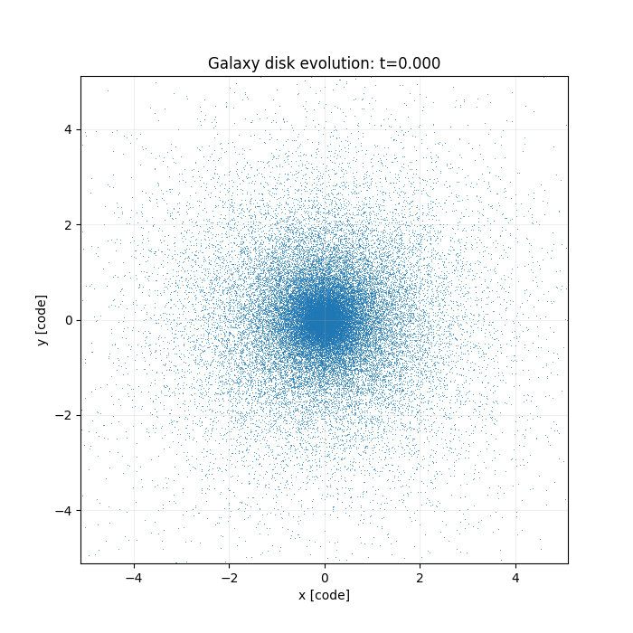

# Welcome to Odisseo (Optimized Differentiable Integrator for Stellar Systems Evolution of Orbits)

[](https://opensource.org/licenses/MIT)
[](https://odisseo.readthedocs.io/en/latest/?badge=latest)
[](https://doi.org/10.5281/zenodo.14992689)


`odisseo` differentiable direct Nbody written in `JAX`.

## Highlight: 200k-Particle Galaxy Disk (FMM)

Generated with the new `jaccpot` large-`N` radix integration path in ODISSEO:




## Installation

`odisseo` can be installed via by cloning the repo and then via `pip`

```bash
git clone https://github.com/vepe99/Odisseo.git
cd Odisseo
pip install .
```


## Notebooks for Getting Started

- Self gravitating system
    - [2 body problem](notebooks/2body.ipynb)
    - [Self gravitating Plummer sphere](notebooks/Plummer.ipynb)

- External Potentials
    - [Plummer sphere in NFW potential](notebooks/Plummer_in_NFWpotential.ipynb)

- Gradient
    - [Plummer sphere in NFW with gradient](notebooks/gradient_test/grad_NFW_Potential.ipynb)


### Unified Integration API

Use `odisseo.integrate(...)` as the main entrypoint. Backend selection is done via `SimulationConfig.acceleration_scheme`:

- direct schemes (`DIRECT_ACC`, `DIRECT_ACC_LAXMAP`, `DIRECT_ACC_MATRIX`, ...)
- `FMM_ACC` for the Jaccpot-FMM coupler workflow

Key FMM tuning fields in `SimulationConfig`:
- `fmm_refresh_every`, `fmm_leaf_size`, `fmm_max_order`
- `fmm_preset`, `fmm_basis`, `fmm_theta`, `fmm_runtime_path`, `fmm_mac_type`
- `fmm_farfield_mode`, `fmm_nearfield_mode`, `fmm_nearfield_edge_chunk_size`, `fmm_tree_leaf_target`
- `fmm_auto_large_n_profile`, `fmm_large_n_min_particles`, `fmm_large_n_force_fp32`

Large-`N` GPU runs can now auto-switch from `fmm_preset="fast"` to jaccpot's
radix fast lane (`"large_n_gpu"` preset + `"large_n"` runtime path) when
`fmm_auto_large_n_profile=True` and particle count exceeds
`fmm_large_n_min_particles`.

Example:

```python
from odisseo.integration_api import integrate
from odisseo.option_classes import SimulationConfig, SimulationParams, FMM_ACC

cfg = SimulationConfig(
    N_particles=128,
    acceleration_scheme=FMM_ACC,
    num_timesteps=200,
    fixed_timestep=True,
    fmm_refresh_every=4,
)
params = SimulationParams(G=1.0, t_end=1.0)
state_out = integrate(state0, masses, cfg, params)
```

Galaxy-disk large-`N` example (auto-selects jaccpot radix fast lane on GPU):

```bash
python notebooks/scalability/galaxy_disk_fmm_large_n.py --n-particles 200000 --num-steps 200
```

Render snapshots live after the run (use `--mode render`):

```bash
python notebooks/scalability/galaxy_disk_fmm_large_n.py --n-particles 200000 --num-steps 200 --mode render --live --snapshot-stride 1 --snapshot-chunk-steps 20
```

Record a movie (`.gif` or `.mp4`; use `--mode render`):

```bash
python notebooks/scalability/galaxy_disk_fmm_large_n.py --n-particles 200000 --num-steps 200 --mode render --movie-path ./galaxy_disk.gif --movie-fps 24 --snapshot-stride 1 --snapshot-chunk-steps 20
```
