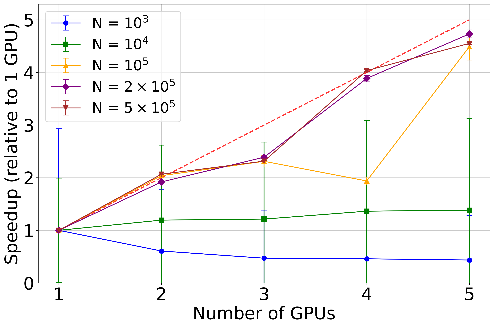

Distributed simulations
=======================

Odisseo leverages JAX’s native support for data-parallel computation to scale N-body simulations efficiently across one or more GPUs. This is particularly useful when:
 - [Running many simulations in parallel on a single device](#parallel-simulation-on-a-single-device).
 - [Running many simulations in parallel on a multiple devices](#parallel-simulations-on-multiple-devices).
 - [Accelerating a single large simulation across multiple devices](#parallelizing-a-single-simulation-on-multiple-devices).
JAX encourages a "computation follows data" strategy: once your data is on a device (e.g., a GPU), JAX will execute the corresponding operations on that same device automatically.

## Selecting devices
When a GPU is available, `jax` will pre-allocate memory and natively use it. If multiple GPUs are availables, memory will be pre-allocated on all them, but the data is put only on the first `GpuDevice(id=0)`. 

### GPU
For GPU selection the `autocvd` package is suggested:

```python
from autocvd import autocvd
autocvd(num_gpus = 2)                       #automatically choses two free GPU
```

or alternatevly 

```python
import os
os.environ["CUDA_VISIBLE_DEVICES"] = "0, 1"  # Use only the first 2 GPU
```

### CPU
For CPU it suggested to adopt the built in `jax` function as follow:

```python
import jax

jax.config.update('jax_num_cpu_devices', 2)
```

## Parallel simulation on a single device
When running on a single device, it is suggested to use the `jax.vmap` function.
A minimal example is presented below for a 7 parameters problem:

```python 
from autocvd import autocvd
autocvd(num_gpus = 1)

import time

import jax
import jax.numpy as jnp
from jax import jit, random

jax.config.update("jax_enable_x64", True)

import numpy as np
from astropy import units as u

from odisseo import construct_initial_state
from odisseo.dynamics import  DIRECT_ACC_MATRIX
from odisseo.option_classes import SimulationConfig, SimulationParams
from odisseo.option_classes import MNParams, NFWParams, PlummerParams, PSPParams
from odisseo.option_classes import  MN_POTENTIAL, NFW_POTENTIAL, PSP_POTENTIAL
from odisseo.initial_condition import Plummer_sphere
from odisseo.time_integration import time_integration
from odisseo.units import CodeUnits
from odisseo.utils import projection_on_GD1

code_length = 10.0 * u.kpc
code_mass = 1e4 * u.Msun
code_time = 3 * u.Gyr
code_units = CodeUnits(code_length, code_mass, G=1, unit_time = code_time )  


config = SimulationConfig(N_particles = 1_000,
                          return_snapshots = False, 
                          num_timesteps = 1000, 
                          external_accelerations=(NFW_POTENTIAL, MN_POTENTIAL, PSP_POTENTIAL), 
                          acceleration_scheme = DIRECT_ACC_MATRIX,
                          softening = (0.1 * u.pc).to(code_units.code_length).value,) #default values

@jit
def run_simulation(rng_key, 
                   params):
    
    #the center of mass needs to be integrated backwards in time first 
    config_com = config._replace(N_particles=1,)
    params_com = params._replace(t_end=-params.t_end,)

    #this is the final position of the cluster, we need to integrate backwards in time 
    pos_com_final = jnp.array([[11.8, 0.79, 6.4]]) * u.kpc.to(code_units.code_length)
    vel_com_final = jnp.array([[109.5,-254.5,-90.3]]) * (u.km/u.s).to(code_units.code_velocity)
    mass_com = jnp.array([params.Plummer_params.Mtot]) 
    
    #we construmt the initial state of the com 
    initial_state_com = construct_initial_state(pos_com_final, vel_com_final,)
    #we run the simulation backwards in time for the center of mass
    final_state_com = time_integration(initial_state_com, mass_com, config=config_com, params=params_com)
    #we calculate the final position and velocity of the center of mass
    pos_com = final_state_com[:, 0]
    vel_com = final_state_com[:, 1]

    #we construct the initial state of the Plummer sphere
    positions, velocities, mass = Plummer_sphere(key=random.PRNGKey(rng_key), params=params, config=config)
    #we add the center of mass position and velocity to the Plummer sphere particles
    positions = positions + pos_com
    velocities = velocities + vel_com
    #initialize the initial state
    initial_state_stream = construct_initial_state(positions, velocities, )
    #run the simulation
    final_state = time_integration(initial_state_stream, mass, config=config, params=params)

    return final_state

#CONSTRUCT THE VMAP VERSION OF THE RUN_SIMULATION
@jit
def vmapped_run_simulation(rng_key, params_values):
    params_samples = SimulationParams(t_end = params_values[0],
                          Plummer_params = PlummerParams(Mtot=params_values[1],)
                          NFW_params = NFWParams(Mvir=params_values[2] ,)
                          MN_params = MNParams(M = params_values[3] ,)
                          G = code_units.G, )
    return run_simulation(rng_key, params_samples)

n_sim = 10                                                          #NUMBER OF SIMULATION TO RUN IN PARALLEL
Mvir = jnp.linspace(params.NFW_params.Mvir * 0.5, params.NFW_params.Mvir * 2, n_sim)
t_end = jnp.linspace(params.t_end * 0.5, params.t_end * 2, n_sim)
M_Plummer = jnp.linspace(params.Plummer_params.Mtot * 0.5, params.Plummer_params.Mtot * 2, n_sim)
M_MN = jnp.linspace(params.MN_params.M * 0.5, params.MN_params.M * 2, n_sim)
params_values = jnp.array([Mvir, t_end, M_Plummer, M_MN]).T         #SHAPE(N_SIM, 4)   
key = jnp.arange(n_sim)

simulations = jax.vmap(vmapped_run_simulation)(params_values,  key) #SHAPE(N_SIM, N_PARTICLES, 2, 3)
```

## Parallel simulations on multiple devices
When running multiple independend simulations in parallel the input parameters are sharded into the available devices.
A minimal example is presented below for the same 4 parameters problem as before, the set up of the simulation is equivalent:

```python
from autocvd import autocvd
autocvd(num_gpus = 2)               #RUN ON 2 GPUs

from jax.sharding import Mesh, PartitionSpec, NamedSharding         #IMPORT NEEDED FOR AUTOMATIC PARALLELISM


# IMPORT AND SET UP THE SIMULATION
n_sim = 10                                                          #NUMBER OF SIMULATION TO RUN IN PARALLEL, IT MUST BE DIVISIBLE BY THE NUMBER OF GPUs
Mvir = jnp.linspace(params.NFW_params.Mvir * 0.5, params.NFW_params.Mvir * 2, n_sim)
t_end = jnp.linspace(params.t_end * 0.5, params.t_end * 2, n_sim)
M_Plummer = jnp.linspace(params.Plummer_params.Mtot * 0.5, params.Plummer_params.Mtot * 2, n_sim)
M_MN = jnp.linspace(params.MN_params.M * 0.5, params.MN_params.M * 2, n_sim)
params_values = jnp.array([Mvir, t_end, M_Plummer, M_MN]).T         #SHAPE(N_SIM, 4)   
key = jnp.arange(n_sim)

#SHARD THE INPUT OF THE SIMULATION
mesh = Mesh(np.array(jax.devices()), ("n_sim",))                                                    #MESH OBJECT FOR JAX AUTOMATIC PARALLELISM                
params_values_sharded = jax.device_put(params_values, NamedSharding(mesh, PartitionSpec("n_sim")))  #PUT THE INPUT VALUES ON THE GPUs

#RUN THE SIMULATION AS USUAL
simulations = jax.vmap(vmapped_run_simulation)(params_values,  key) #SHAPE(N_SIM, N_PARTICLES, 2, 3)
```

## Parallelizing a single simulation on multiple devices
In the case of very large number of particles, a simulation can benefit by sharding the `initial_conditions` (positions and velocities) and `masses` across multiple GPUs to speed up the computation. The sharding can help to reduce the RAM requirement, and speed up the computational time, but for very few `N_particles` the time will be dominated by the comunication time between devices. In order to achieve this the two arrays must be sharded as shown in the following example (the set up is similar to the previous example):

```python
from autocvd import autocvd
autocvd(num_gpus = 2)               #RUN ON 2 GPUs

from jax.sharding import Mesh, PartitionSpec, NamedSharding         #IMPORT NEEDED FOR AUTOMATIC PARALLELISM

#THIS TIME THE PARAMETERS STAY FIXED
params = SimulationParams(t_end = (3 * u.Gyr).to(code_units.code_time).value,  
                          Plummer_params= PlummerParams(Mtot=(10**4.05 * u.Msun).to(code_units.code_mass).value,
                                                        a=(8 * u.pc).to(code_units.code_length).value),
                           MN_params= MNParams(M = (68_193_902_782.346756 * u.Msun).to(code_units.code_mass).value,
                                              a = (3.0 * u.kpc).to(code_units.code_length).value,
                                              b = (0.280 * u.kpc).to(code_units.code_length).value),
                          NFW_params= NFWParams(Mvir=(4.3683325e11 * u.Msun).to(code_units.code_mass).value,
                                               r_s= (16.0 * u.kpc).to(code_units.code_length).value,),                      
                          G=code_units.G, ) 

config = SimulationConfig(N_particles = 1_000_000, #PARALLELIZIZATION IS USEFUL WHEN THE N_particels IS LARGE, 
                          return_snapshots = False, 
                          num_timesteps = 1000, 
                          external_accelerations=(NFW_POTENTIAL, MN_POTENTIAL, PSP_POTENTIAL), 
                          acceleration_scheme = DIRECT_ACC_MATRIX,
                          softening = (0.1 * u.pc).to(code_units.code_length).value,) #default values

#set up the particles in the initial state
positions, velocities, mass = Plummer_sphere(key=random.PRNGKey(4), params=params, config=config)

#initialize the initial state
initial_state = construct_initial_state(positions, velocities)
mesh = Mesh(np.array(jax.devices()), ("i",))                                            #MESH OBJECT FOR JAX AUTOMATIC PARALLELISM     
initial_state = jax.device_put(initial_state, NamedSharding(mesh, PartitionSpec("i")))  #PUT THE initial_state  ON THE GPUs
mass = jax.device_put(mass, NamedSharding(mesh, PartitionSpec("i")))                    #PUT THE mass ON THE GPUs

simulation = time_integration(initial_state_stream, mass, config=config, params=params) #RUN DIRECTLY THE time_integration function
```

Below a benchmark of this sharding scheme. It can be appreciated that for very large `N_particles` an almost linear scaling is achieved with respect to the number of GPUs.
This benchmark was run on NVIDIA A100 with 40GB of memory.
