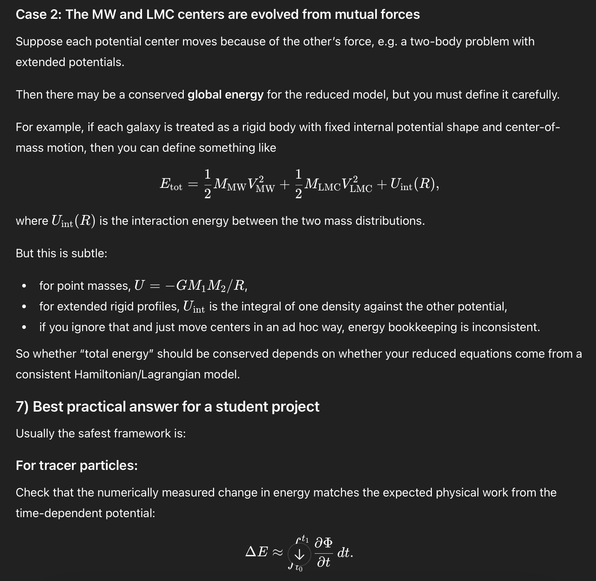

# Research Notes

This document is supposed to contain all general notes regarding the work on reflex motion.

## Basic Information

### Odisseo

- How does `Odisseo` handle the varying simulation outputs when using different time steps? Can it also be tracked using the total energy and angular momentum?
  - Adaptive Timesteps: Only works with `diffrax` as the integrator combined with a `diffrax` solver (best: `DOPRI5` and `TSIT5`) and `diffrax` backend.
  - Total energy and angular momentum conservation can be checked if timesteps are too large.
- What is the `3MN` branch for? Are there already first steps for adding an additional potential (see `3body.ipynb`)?
  - `ml4ps` was for a publication.
  - `3MN` (Three Miyamoto-Nagai potential) is the current developer branch from Giuseppe.
  - Multiple potentials are already supported, but at the moment the central potential (Milky Way) is fixed at the origin.
- Is the shape of the central potentials influenced by the outlaying clouds?
  - No, this is a possible future implementation.
- The `GD1` notebooks use the most modern scripts.
- Each potential needs the following parameters:
  - Initial state containing the position and velocity.
  - 'Parameters' like mass and radius.
  - 'Configs' like number of particles and timesteps.

### Jax

- In the automatic differentiation tutorial, the same calculation performed by `jax` and `scipy` give different results. Why is that? Is it simply precision, or does `svd` allow multiple solutions?
  - It should not give a different result, maybe a floating error is happening, as `jax` uses `float32` while scipy prefers `float64`.
- When importing JAX, it instantly allocates 70% of the main GPU and spawns microprocesses on all other GPUs. This can be solved in two ways:
  - `Autocvd`: Automatically chooses a single free GPU.

    ```python
    from autocvd import autocvd
    autocvd(num_gpus = 1)
    ```

  - Sometimes a GPU has memory in use, even though no one is using them. For this specify the wanted GPU directly using its number:

    ```python
    import os
    os.environ["CUDA_VISIBLE_DEVICES"] = "0"
    ```

- Use `jax.debug` instead of `print` for debugging.

### IWR

How do I access the Intranet and computing server? Online I only found the IWR Gitlab or platforms, where I have to login using my Uni account, not IWR account.

#### GPU Compute Server

- There are 14 different nodes available, each with multiple GPUs of the same type. They can be accessed using ssh in the university network as follows. Use the number 1 to 14 for `*`:

  ```bash
  ssh rpretsch@compgpu*.iwr.uni-heidelberg.de
  ```

- Add the following to `~/.ssh/config` to allow access using only:

  ```bash
  ssh compgpu*
  ```

  ```bash
  Host compgpu*
    User rpretsch
    HostName %h.iwr.uni-heidelberg.de
  ```

- If a local ssh key exist, enter the following to enable password-less connection. This allows for a password-less connection to all nodes.

  ```bash
  ssh-copy-id compgpu1
  ```

- Using the proxy to access the compute servers without a VPN as stated in the [wiki](https://hd.bwpages.de/iwr/wiki/Resources/2_Connection/ssh/#remote-connection-ssh-proxy) not currently working.
- [GPU Dashboard](https://compmon.iwr.uni-heidelberg.de:3000/d/adya2pf5n2xa8f3/gpu-overview?orgId=1&from=now-1h&to=now&timezone=browser&var-origin_prometheus=&var-job=nvidiaprometheus&var-hostname=$__all&var-instance=$__all&var-index=$__all&var-username=mklockow&var-groupname=SciAI&refresh=auto)

- Only one task per GPU (except for tasks from the same group when the workload is predictable).
- `nvidia-smi` in terminal shows workload of the GPUs directly in the terminal.
  - `gpustat` is a better alternative.

#### Wiki

- [Wiki](https://hd.bwpages.de/iwr/wiki/Resources/Compute/)

#### Workspace

- Final data in `/export/data/rpretsch` (3TB)
- Temporary data in `/export/scratch/rpretsch` (5.5TB)
- Home folder `/export/home/rpretsch` (100GB)
- Data in folder is the same between nodes
- Backup of large simulation files on [Zenodo](https://zenodo.org/) possible.
- Use python scripts instead of notebooks.
  - Kernel does not release memory when notebook crashes.
- [tmux](https://github.com/tmux/tmux/wiki) to detach/split terminal

## Reflex Motion Project

The plan is to allow the central potential (Milky Way) to become dynamic and move due to the potential of the surrounding ones (Large Magellanic Cloud). Multiple potentials are already supported.

### Plan

- Modify the Milky Way potential to allow adding an initial state, and return new state after a simulation step.
- Add LMC and check whether the trajectory of a halo star changes and how much.
- Keep everything functional to support `jax` throughout.
- Backwards compatibility not needed.
- Dynamical friction only needed (if at all) for LMC, as it is very small.

### Resources

- [Updated Paper](https://arxiv.org/pdf/2510.04735)
- [Original Paper](https://arxiv.org/pdf/2507.10667)

### How It Works

- Milky Way potential application: `time_integration()` function -> `time_integration.py` -> `integrators.py` -> `potentials.py` -> `combined_external_acceleration_vmpa_switch()` function -> potential functions
  - In `SimulationConfig`, `external_accelerations` variable takes which potentials are used for the Milky Way, which then applies the chosen potentials in `combined_external_acceleration_vmpa_switch()`
  - At the moment, the potential functions calculate the distance for the Milky Way potential as the norm of their coordinates.
- All other potentials applications: `time_integration()` function -> `time_integration.py` -> `integrators.py` -> `dynamics.py` -> `direct_acc_...()` function -> `single_body_acc()` function
  - In `SimulationConfig`, `acceleration_scheme` controls how exactly the acceleration is computed. This is used to control the exact `direct_acc_...()` needed. However, every of those functions calls `single_body_acc()` to perform those accelerations.
- If `return_potential` is true, the potential energy of the particle is returned as a single value per particle
- Odisseo is a functional program because this makes it differentiable and jit-compatible (`JAX`-compatible).
  - Classes make problems, but dictionaries work well.

### TODO

- Investigate pytest.
- Make potentials reusable.
  - Work closely together with Giuseppe on this (he will do the main work).
  - Work will be done on branch of my branch.
  - Make the params data-class a dict of data-classes.

    ```python
    config = SimulationConfig(...,
                              external_potentials = (("halo_MW",), ("halo_LMC",))
                              )

    params = SimulationParams(t_end = ...,
                              G = ...,
                              potentials = dict["halo_MW": NFWParams(...),
                                                "halo_LMC": NFWParams(...),
                                                ]
                              )
    ```

- Tracer stars in MW halo to see how they respond to LMC.
- Split simulation scripts into data generation and plotting files.
- Add numerical validation method.
  - The current method (checking total energy and total angular momentum) does not work for interacting potentials (MW and LMC). This is because their forces are not symmetric due to different potential modelling.
  - Currently the only viable option seems to be to use smaller and smaller timesteps and see if the trajectories converge
  - Add $U_\text{int}$ to calculations of total energy.
    
- Validate MW-LMC movement on other simulations.

### On Hold

- Add a variable for the MW disc inclination.
  - Angle between velocity vector of LMC and vector on Milky Way disc.
  - Should not this simply be done using the coordinates of the LMC?
- Fix MW in center of coordinate system/
  - Probably more efficient and useable results, if done in post by subtracting the MW trajectory from all trajectories.

### Done

- Added new `SimulationConfig` flag `reflex_motion` to enable/disable reflex motion behavior.
- Amended potentials in `potentials.py` to use the first `state` entry as external potential; ignoring it in their calculations. Also, the state of the external potential is used in all distance/position calculations to get the correct relative distance.
  - Iterates over `config.external_accelerations`, to get the index of the external potentials (LMC, MW) in the state array, this then get masked out.
- Milky Way does not move due to other particles anymore.
- Unlimited 'external' potentials can now be added. Theses external potentials only interact with each other, not with the other particles. Their state is saved together with the particles in `state`, and the index of the potentials in `external_accelerations` decides which state index is which external potential. For this an additional depth (dimension?) has been added to `external_accelerations`. The first entry corresponds to the first particle in `state` etc.
- Dynamical friction is automatically applied if at least two external potentials are added, the first one contains an NFW potential (MW halo), and the second one a Hernquist potential (LMC). The resulting acceleration gets added at each step to the LMC acceleration in `potentials.py`. This solution is hardcoded
- Parameters are now the same as used in `galpy`.
  - Added distinction between viral and characteristic mass for the NFW profile. The potential uses the characteristic mass, while the dynamical friction uses the viral mass.
  - LMC Hernquist profile still uses the parameters from Brooks et al (2025).
